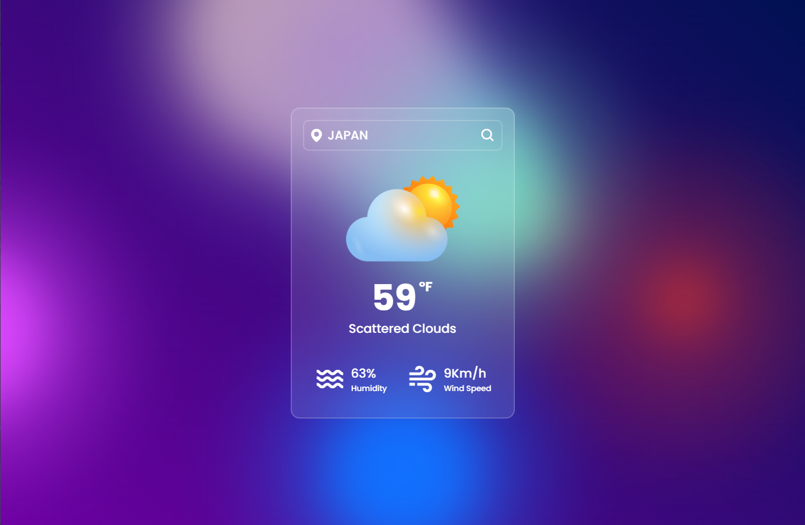

# 🌦️ Weather App

A responsive and visually engaging weather app that shows live weather conditions with smooth background animations. Built using **Vite**, **TypeScript**, and the **OpenWeatherMap API**.

## 📸 Demo

[Live Demo](https://gavinnewin.github.io/weather-app/)


---

## 🌟 Features

- Search any city for live weather data
- Displays temperature (°F), weather conditions, humidity, and wind speed
- Dynamic weather icons that change with conditions
- Error handling for unknown locations
- Animated gradient background that follows your mouse

---

## 🚀 Technologies Used

- [Vite](https://vitejs.dev/)
- TypeScript
- HTML & CSS
- OpenWeatherMap API (https://openweathermap.org/api)
- Boxicons + Google Fonts

---

## ⚙️ Getting Started Locally

1. Clone the repo:
   ```bash
   git clone https://github.com/your-username/weather-app.git
   cd weather-app

2. Install dependencies:
   ```bash
   npm install

3. Run the dev server:
   ```bash
   npm run dev

## 📷 Screenshots

### Homepage


### Search Functionality


### Not Found 

